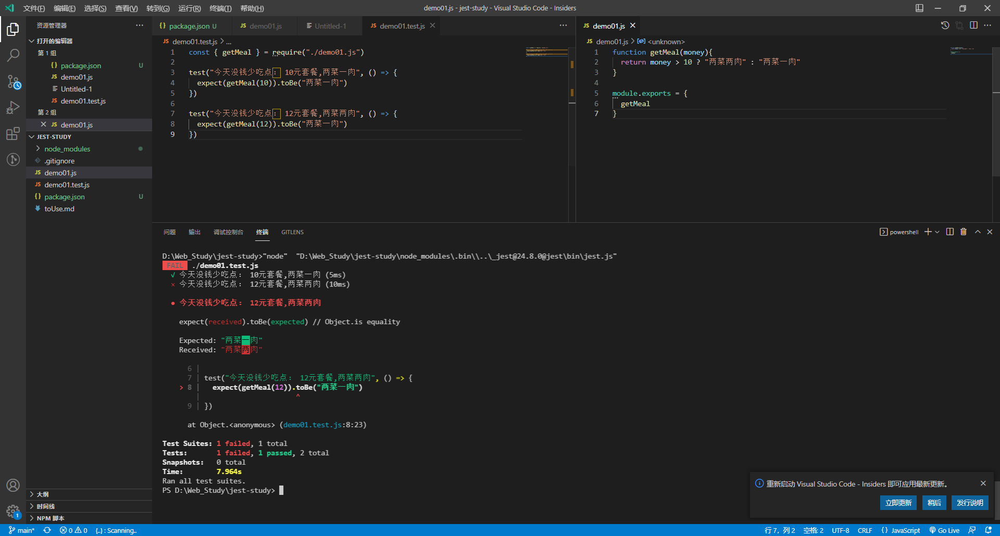

# Jest

## 1.介绍

### 1.1简介


### 1.2.快速上手

**注：**<span style="background-color: #ffcc66">代码结构</span>、<span style="background-color: #ffcc66">详情</span>以及<span style="background-color: #ffcc66">测试结果</span>。



**第一步：**开发环境安装依赖

```nginx
npm install jest@24.8.0 -D
```

**第二步：**写测试用例

```js
* 1.demo01.js
	向外暴露需要测试的function
* 2.demo01.test.js
	文件名一般要与要测试模块名一样，后缀 .test.js
 	eg.
 		test("描述", () => {
 			// expect(要测试的方法(形参))  		这个会返回真实结果
        	// expect(...).toBe(预期结果) 	   toBe使用 真实结果 与 预期结果 做比较
 		})
```

**第三步：**改package.json中的script

```json
"scripts": {
	"test": "jest"
}
```

**第四步：**运行测试

```nginx
npm run test
```

## 2.开始学习

### 2.1第一个demo

